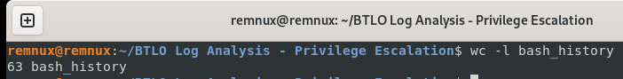
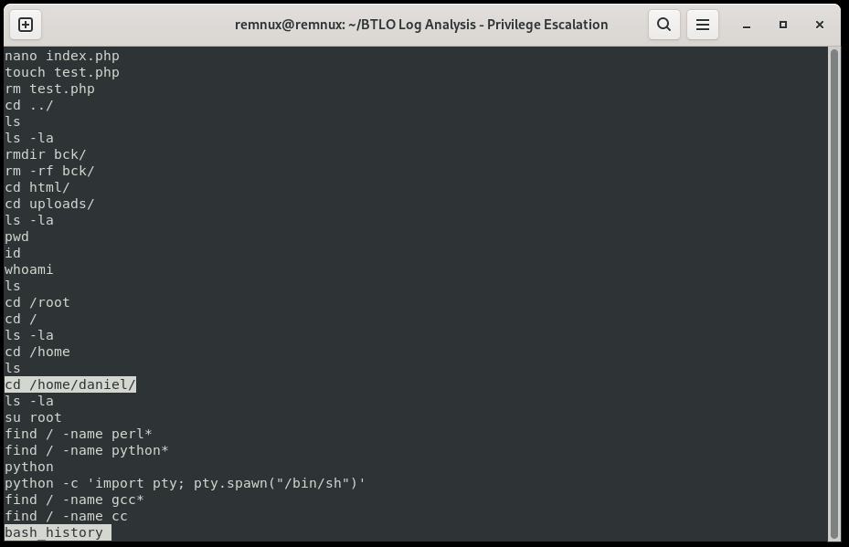
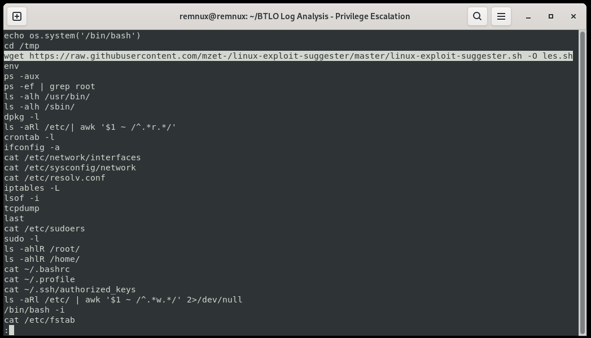
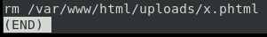
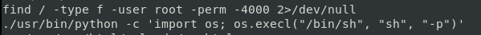

# Log Analysis - Privilege Escalation
https://blueteamlabs.online/home/challenge/log-analysis-privilege-escalation-65ffe8df12

## Scenario
A server with sensitive data was accessed by an attacker and the files were posted on an underground forum. This data was only available to a privileged user, in this case the `root` account. Responders say `www-data` would be the logged in user if the server was remotely accessed, and this user doesn’t have access to the data. The developer stated that the server is hosting a PHP-based website and that proper filtering is in place to prevent php file uploads to gain malicious code execution. The bash history is provided to you but the recorded commands don’t appear to be related to the attack. Can you find what actually happened?

## Challenge Questions
### What user (other than 'root') is present on the server?
Initial triage of the log file via `wc -l bash_history` indicated a total of 63 entries. Inspection of the command history using `less` revealed the presence of an alternate local user account through the execution of `cd /home/daniel/`.

*Figure 1: Identification of the user directory `/home/daniel/` within the bash history.*

### What script did the attacker try to download to the server?
The command history indicates the attacker initiated an outbound connection via `wget` to retrieve `linux-exploit-suggester.sh`. This automated post-exploitation tool is designed to scan the local operating system for unpatched vulnerabilities and suggest public privilege escalation exploits.

*Figure 2: The `wget` request targeting the privilege escalation scanning script.*

### What packet analyzer tool did the attacker try to use?
The attacker attempted to execute `tcpdump`, a command-line utility used for network packet capture and analysis.

### What file extension did the attacker use to bypass the file upload filter implemented by the developer?
The attacker circumvented the application's file upload restrictions by using the alternative PHP executable extension `.phtml`. The log capture shows the attacker subsequently attempting anti-forensics measures by deleting the uploaded file.

*Figure 3: Command showing the removal of `.phtml` web shell file.*

### Based on the commands run by the attacker before removing the php shell, what misconfiguration was exploited in the ‘python’ binary to gain root-level access?
The attacker exploited an incorrectly configured SUID (Set Owner User ID) bit on the Python binary to spawn a privileged shell. The log shows the attacker executing `find / type -f -user root -perm -4000 2>/dev/null` to enumerate files owned by `root` that run with elevated privileges, effectively identifying Python as a viable vector for privilege escalation.

*Figure 4: Enumerate command used to identify SUID binaries on the system.*