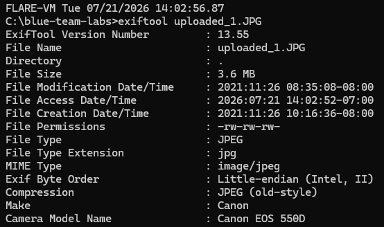
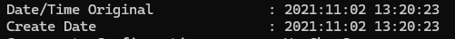

# Meta
https://blueteamlabs.online/home/challenge/meta-b976cec9e2

## Scenario
Two images were posted by a criminal on the run, with the caption "I'm roaming free. You will never catch me". We believe you can assist us in proving him wrong.

## Challenge Questions
### What is the camera model?
Using `exiftool` we see that the camera model is listed as `Canon EOS 550D`

### When was the picture taken?
Further down the `exiftool` output, the `Create Date` value is listed as `2021:11:02 13:20:23`

### What does the comment on the first image say?

The comment text is `relying on altered metadata to catch me?`

### Where could the criminal be?

Although the GPS metadata has been tampered with, you can still use tools such as Google's reverse image search to find locations. Using the reverse image search with the second image confirms that the location is `Kathmandu Durbar Square` in `Kathmandu, Nepal`.

