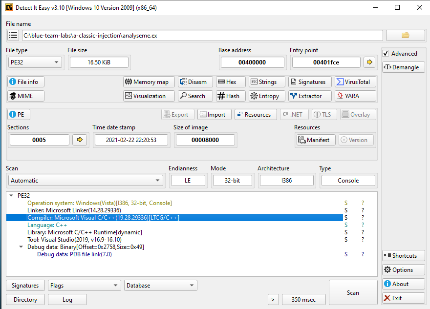
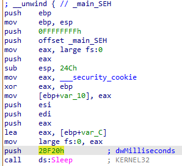
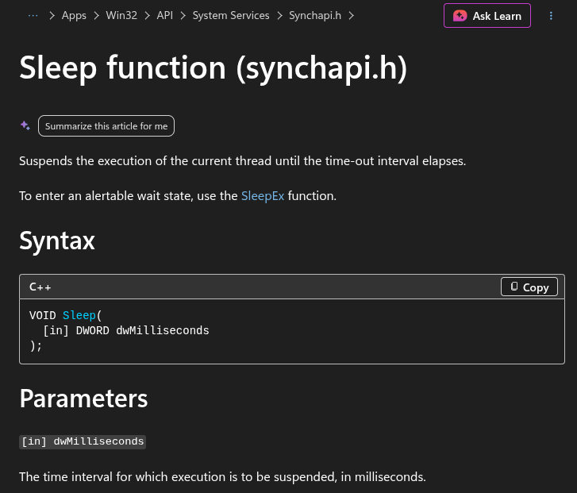
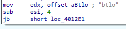
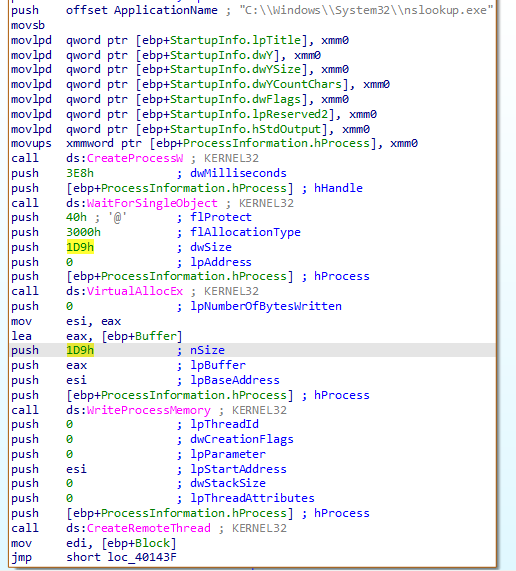
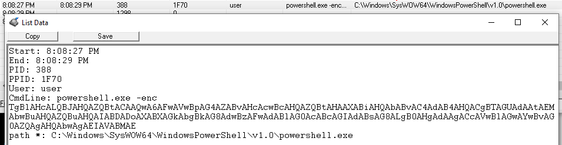
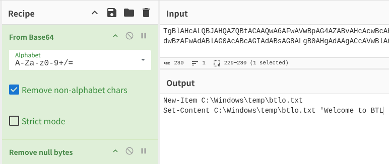

# Reverse Engineering - A Classic Injection
https://blueteamlabs.online/home/challenge/reverse-engineering-a-classic-injection-9791a9b784

## Scenario
Analyze the attached EXE sample and find answers to the following questions.
Note: The EXE uses shellcode generated by the Metasploit attack framework. Make sure you analyze the sample in contained environment (we recommend a virtual machine where internet access is disabled).

## Challenge Questions
### What is the name of the compiler used to generate the EXE?
Initial static analysis using `Detect It Easy (DiE)` identified the compiler as `Microsoft Visual C/C++`.

*Figure 1: The Detect It Easy (DiE) interface showing the compiler identification.*

### This malware, when executed, sleeps for some time. What is the sleep time in minutes?
Disassembly of the `main` function in `IDA` revealed a call to the Windows `Sleep` function. This function accepts a `DWORD` value representing the suspension duration in milliseconds. The value passed to the function is `2BF20` (hexadecimal), which converts to `180,000` milliseconds.

`180,000 ms / 1,000 ms/sec = 180 seconds`

`180 seconds / 60 sec/min = 3 minutes`

The total configured sleep time is 3 minutes.

*Figure 2: The `main` function disassembly view in `IDA`.*

*Figure 3: The `Sleep` function documentation provided by Microsoft.*

### After the sleep time, it prompts for user password, what is the correct password?
Moving down the `main` function the string `"btlo"` can be seen.

*Figure 4: The hardcoded password string in `main`.*

### What is the size of the shellcode?
Inspection of the parameters passed to the memory allocation functions during the injection phase revealed the shellcode size. The `dwSize` (or `nSize`) parameter passed to `VirtualAllocEx` is set to `1D9` in hexadecimal, which converts to `473` bytes.

*Figure 5: Shellcode with its size listed.*

### Shellcode injection involves three important windows API. What is the name of the API Call used?
- `CreateProcessW`: Spawns the target host process in a suspended state.
- `VirtualAllocEx`: Allocates an available region of memory within the virtual address space of the target process.
- `WriteProcessMemory`: Writes the shellcode payload into the newly allocated memory space.
- `CreateRemoteThread`: Initiates execution by creating a new thread within the context of the remote process.

### What is the name of the victim process?
The process being hijacked is `nslookup.exe`, and can be seen at the top of *Figure 5*.

### What is the file created by the sample?
Because static string analysis yielded limited indicators, dynamic analysis was performed using `ProcWatch` inside an isolated `FlareVM` virtual machine. After the 3-minute execution delay elapsed, the malware spawned a `Base64` encoded PowerShell command. Decoding the payload via `CyberChef` exposed the underlying script responsible for creating the output file.

*Figure 6: `Base64` encoded malware payload.*

*Figure 7: `Base64` decoded malware payload.*

### What is the message in the created file?
`Welcome to BTL`

### What is the program that the shellcode used to create and write this file?
`powershell.exe`