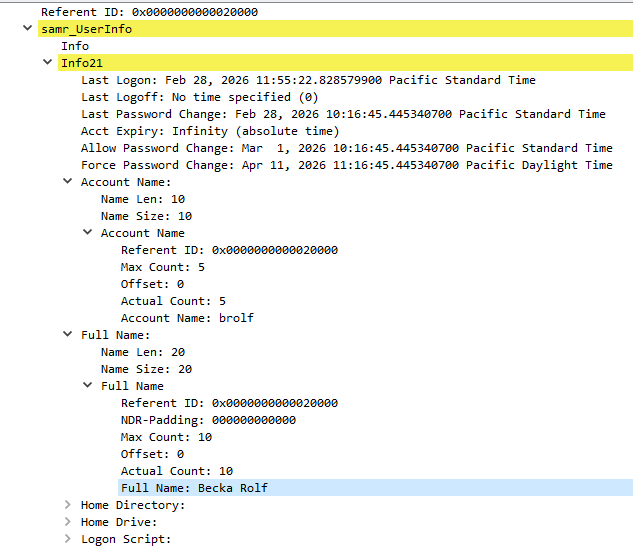
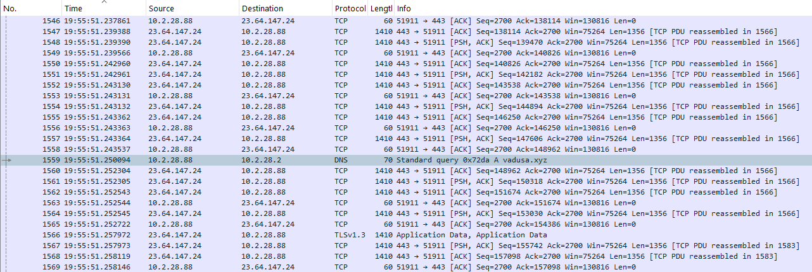
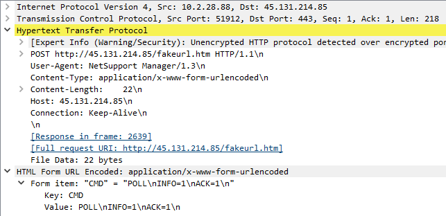
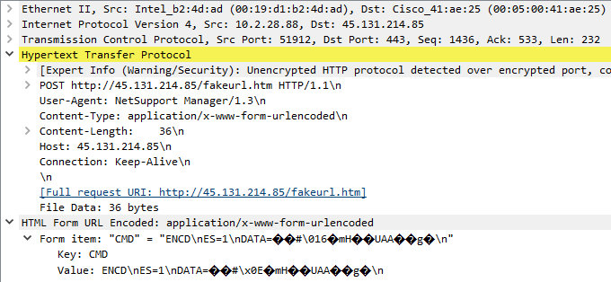

# Incident Triage Report: NetSupport Manager RAT (Easy As 123)
https://www.malware-traffic-analysis.net/2026/02/28/index.html

## 1. Executive Summary
On February 28, 2026, an analyst identified a critical security incident involving an internal Active Directory asset. Internal host `DESKTOP-TEYQ2NR` (`10.2.28.88`) was compromised by the NetSupport Remote Access Trojan (RAT). The initial compromise stemmed from a malicious web redirect during a standard web browsing session, resulting in a payload download from a malicious domain. The asset is currently active on the network and executing persistent Command and Control (C2) beaconing. Immediate containment is required.

<h2 style="text-align: center;">Incident Metadata</h2>

| Field | Value |
| :--- | :--- |
| **Incident Date/Time** | 2026-02-28 @ 19:55 UTC |
| **Severity** | High / Critical |
| **Infected Hostname** | `DESKTOP-TEYQ2NR` |
| **Infected Internal IP** | `10.2.28.88` |
| **Victim MAC Address** | `00:19:d1:b2:4d:ad` |
| **Affected User Account** | brolf |
| **User Full Name** | Becka Rolf |

*Figure 1: Wireshark packet details showing SAMR (Security Account Manager Remote) UserInfo structure (Info21), explicitly mapping the account name 'brolf' to the full name 'Becka Rolf'.*

## Technical Analysis & Timeline
### 1. Initial Access & Delivery (19:55 UTC)
- The victim host (`10.2.28.88`) established a high-volume HTTPS connection with a legitimate Akamai CDN node (`23[.]64[.]147[.]24`).
- The network traffic shows a massive, reassembled TLSv1.3 data stream originating from this CDN node. This stream appears to represent the initial delivery of the malicious payload to the client endpoint.

*Figure 2: Chronological packet stream showing a sudden background DNS query for `vadusa[.]xyz` during active, legitimate HTTPS traffic with an Akamai CDN node.*

### 2. Execution & C2 Discovery
- Upon execution of the payload on the local endpoint, the NetSupport RAT was silently installed.
- Immediately upon initialization, the malware attempted to discover its Command and Control infrastructure. The host sent DNS query ID `0x72da` to the Domain Controller (`10.2.28.2`) to resolve the hardcoded C2 domain `vadusa[.]xyz`.
- The DC resolved the domain to the attacker-controlled IP `45[.]131[.]214[.]85`.

### 3. Command and Control (C2) Beaconing
- The client immediately initiated a TCP handshake with `45[.]131[.]214[.]85` over port 443.
- **Session Initialization:** The first application-layer packet sent by the client was an unencrypted `HTTP POST` request containing a baseline check-in handshake (`"CMD" = "POLL\nINFO=1\nACK=1\n"`).
- **Protocol Upgrade:** Once the initial session handshake was established with the NetSupport Gateway, the malware immediately shifted to encrypted requests.
- All subsequent traffic consists of repetitive `HTTP POST` requests utilizing the encryption flag (`CMD=ENCD`) and an encryption status identifier (`ES=1`), obfuscating the raw binary data payloads passed via the `DATA=` variable.

*Figure 3: Dissected HTTP POST form data demonstrating NetSupport RAT traffic signatures, transitioning from a cleartext `POLL` session initialization to an `ENCD` encrypted data state.*

### 4. Indicators of Compromise (IoCs)
- **Malicious C2 Domain:** `vadusa[.]xyz`
- **C2 IP Address:** `45[.]131[.]214[.]85` (NetSupport Gateway)
- **Suspect Delivery Infrastructure:** `23[.]64[.]147[.]24` (Akamai CDN node utilized for initial payload hosting)
- **Network Signature:** `POST` requests to `application/x-www-form-urlencoded` endpoints containing the string values `CMD=ENCD` and `ES=1`.

## Recommended Remediation Actions
1. **Network Isolation:** Isolate `10.2.28.88` from the local network segment immediately to prevent lateral movement within the `EASYAS123` domain.

2. **Credential Revocation:** Force a password reset for the compromised user account in Active Directory and terminate all active concurrent Kerberos tickets for that user.

3. **Endpoint Cleaning:** Wipe and re-image `DESKTOP-TEYQ2NR`. If forensic collection is required, take a volatile memory dump and disk image prior to wiping.

4. **SIEM/Firewall Block:** Add `vadusa[.]xyz` and the associated C2 IP to the enterprise firewall/proxy blocklist. Check SIEM logs to ensure no other internal hosts have queried this domain.