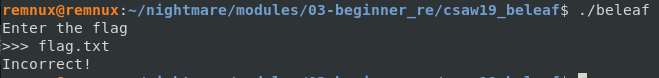
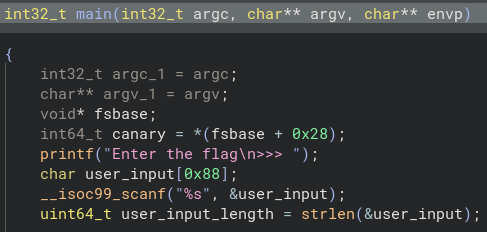
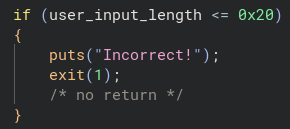
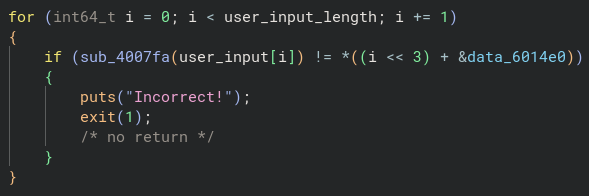
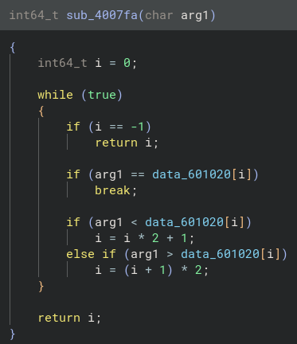
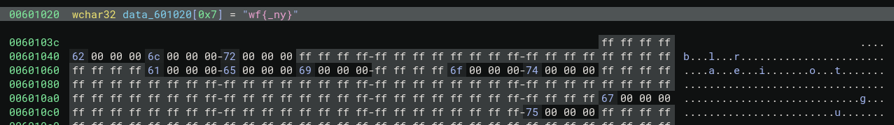
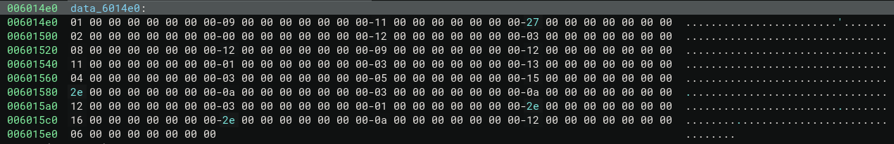
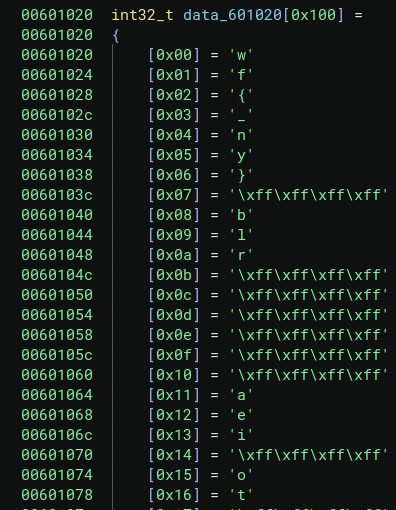
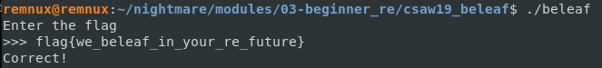

# CSAW 2019 beleaf

Let's start by seeing how the binary functions.

It looks like another challenge where need to provide the correct input. Let's move on to static analysis using Binary Ninja.

I cleaned up the variable names in `main()`. Unlike the last challenge, the flag isn't hardcoded here.

Right below the variable declarations, there is an `if` check that exits the program if the user input length is not greater than 32 (meaning it must be at least 33 characters).

*(Remember, hex `0x20` converts to 32 in base 10.)*

Next, we have a `for` loop that iterates through every character of `user_input`.

Inside the loop, each character is passed to the function `sub_4007fa`. The return value of this function is then checked for inequality against an element in a data array starting at `data_6014e0`.

The expression `i << 3` is *bit shifting* the index value to the left 3 times.

For example, if we had the value of binary 1, and shifted left 3 times, we would have the following:

`0 0 0 1` turns into `1 0 0 0` which is equal to 8 in base 10. This effectively calculates `i * 8`.

The `&` prefix on `&data_6014e0` is the *address-of* operator. The left hand side of the `+` is being used as the *byte offset* added to this base address.

Finally, the `*` outside the parenthesis is *dereferencing* the address we calculated to get the value stored there.

Now that we know how the inequality check works, let's take a look at the logic inside of the `sub_4007fa` function.

The function takes the `char` passed to it and does a couple of checks on the data stored at `data_601020`.

*(Note: The `ff` seen below is equal to -1)*

Double clicking on `data_601020` takes us to the `.data` section of the ELF, where we can see it is an array with different characters stored in it.

***(Note: Binary Ninja incorrectly guesses that this is a `wchar32` string.)***

Let's do a quick recap: we know the input string must be at least 33 characters long. Each character of our input is passed into `sub_4007fa`, which returns its index. That returned index must match the corresponding value inside `data_60114e0`.

The target array (`data_6014e0`) is stored in little-endian format, meaning our target values sit at the beginning of each 8 byte block:

`01 09 11 27 02 00 12 03 08 12 09 12 11 01 03 13 04 03 05 15 2e 0a 03 0a 12 03 01 2e 16 2e 0a 12 06`

At 33 elements long, this looks like the flag, but not the ASCII characters.

I went into the menu and modified the type to display as `int32_t` after finding out Binary Ninja misrepresented the data type. With the proper array structure visible, I realized the numbers in `data_6014e0` are the index positions we need to translate the flag! 

For example: `0x01 = f`

Mapping each index to its corresponding character reveals the following:

`flag{we_beleaf_in_your_re_future}`

**SUCCESS!**