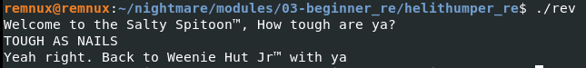
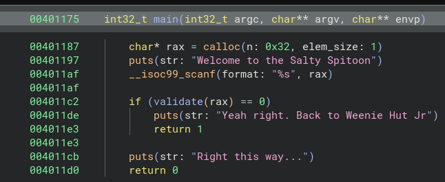
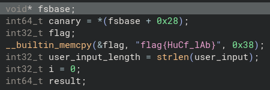
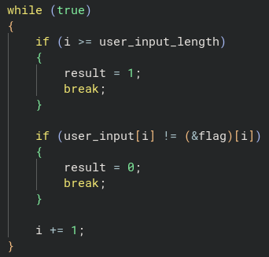
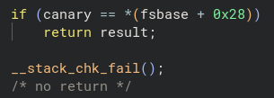
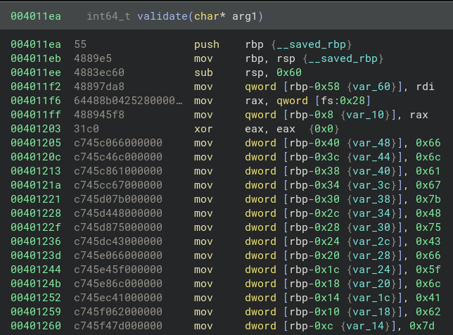
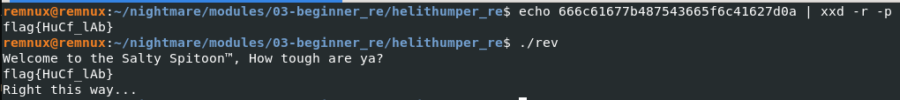

# helithumper re

Let's run the binary and see what kind of input it expects.

It looks like it takes a string and checks for a match. Let's open it up in Binary Ninja for some static analysis.

In the `main()` function, we can see that `validate()` is called with the input string, and the program fails if `validate()` returns `0`.

I switched the Binary Ninja output to "Pseudo C" and cleaned up the variable names. Let's break down the logic in the `validate()` function.

At the top we can see all the variables being set, including the flag, but let's ignore that for now and keep reading the code.

Here, we have `while` loop that uses `i` as the index counter.

The first `if` block checks whether the loop has reached the end of the string. If it has, it sets `result = 1`, meaning the input matches the flag. 

*(Remember, the `if` check in `main()` fails if `validate()` returns `0`)*.

The second `if` block checks if the current character of the user input matches the character at the same index of the flag. If there is a mismatch, the function sets `result = 0`.

Finally, the `i` variable is incremented by 1 so the next character can be tested.

This is a stack *canary*. It helps prevent a *buffer overflow* by aborting execution if the variable is overwritten. With that, we have our flag and the end of the `validate()` function!

As a bonus, let's look the `validate()` function from an assembly perspective.

Here, we can see the string being constructed on the stack, with the characters represented in hexadecimal format. Let's use `echo` and `xxd -r -p` to convert this to ASCII in the terminal.

*(Note: I added `0a` at the end so the terminal outputs a newline).*

**Success!**