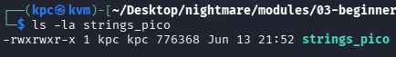
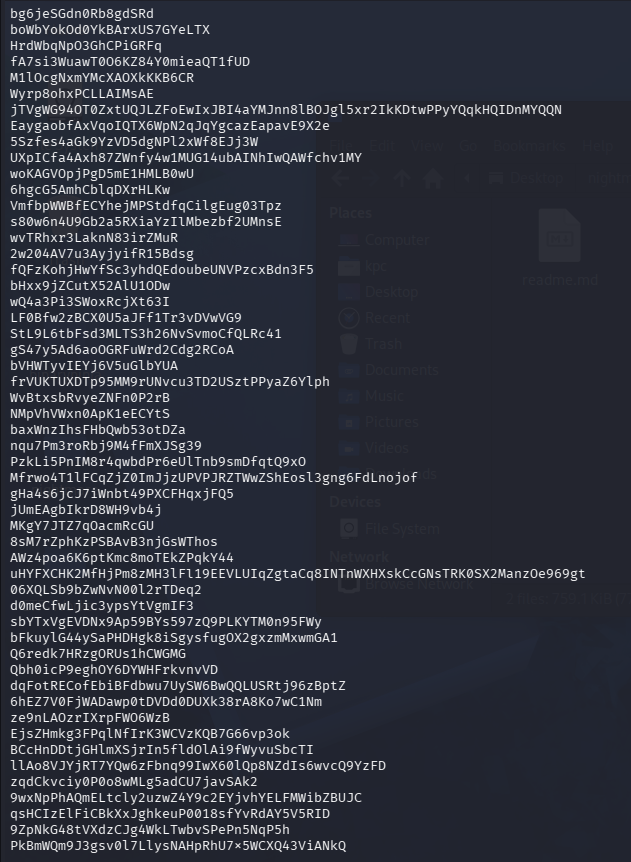
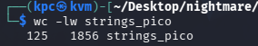
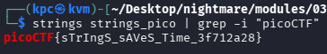

# pico ctf 2018 strings

I guess using `strings` is the "Hello World" of reverse engineering, as this challenge was a straightforward solve.

I checked the file permissions to see if the binary was executable and noticed the file size was larger than I anticipated.

I ran `strings` on the binary, and sure enough, a massive amount of filler text came up.

That's a lot of text. For context, `wc -l` prints the newline count, while `-w` prints the word count.

Next, I used `grep` to search for the flag. After looking up the picoCTF flag format, I found it typically starts with "picoCTF". For good measure, I used `grep` with the `-i` flag to ensure a case-insensitive search.

**Success!**