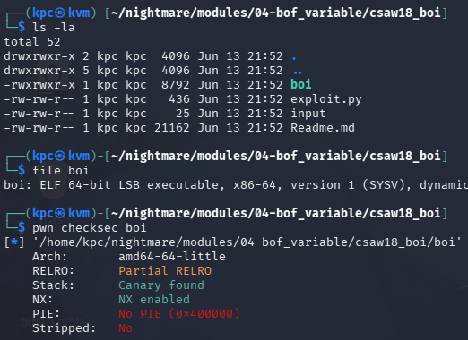
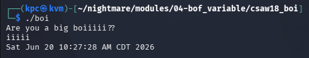
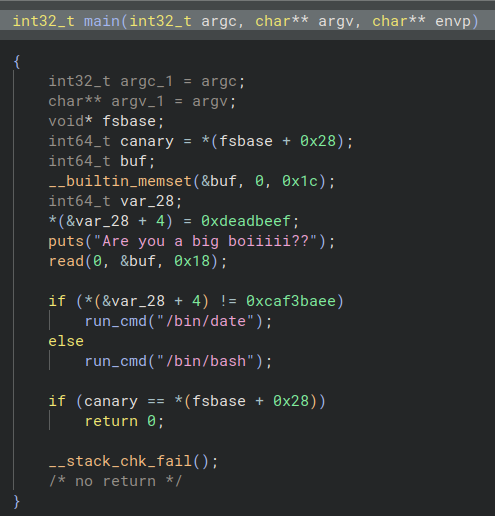
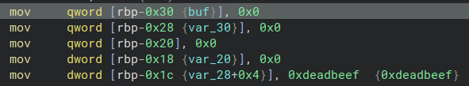
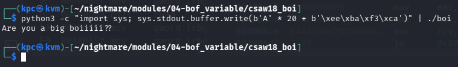
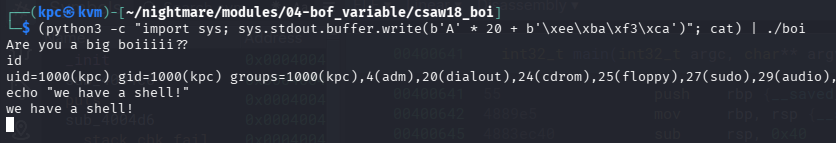
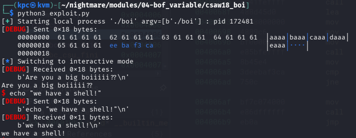

# CSAW 2018 Quals: Boi



We start with an ELF binary that has a stack canary and a non-executable stack.

Let's see what the binary asks for when we run it.



Hm... it seems like the program prompts for a string and returns the current date and time upon failure. Let's move on to static analysis using Binary Ninja.



We can see that the value `0xdeadbeef` is assigned to `var_28 + 4`, right before `puts` is called and user input is received via `read`.

The `read` function takes the following parameters: `read(file_descriptor, buffer, count)`. Since the file descriptor is `0` (stdin), the program will read a maximum of 24 bytes into the `buf` variable.

*(Note: `0x18` converts to 24 in base 10)*

Directly below the `read` call, we see an `if` check: if the value at `var_28 + 4` matches `0xcaf3baee`, the program spawns a shell. The problem is, how do we modify that target variable when `read` is writing into `buf`?



Looking at the stack layout in assembly, we see that `buf` lives at `rbp-0x30` and the hardcoded `0xdeadbeef` sits at `rbp-0x1c`.

`0x30 - 0x1c = 0x14`

Subtracting the target variable's base address from the `buf` base address give us a distance of `0x14` bytes. In decimal, that means we have exactly 20 bytes of buffer space before we start overwriting our target.

*Lucky us!*

Since `read` allows us to input up to 24 bytes, we can fill the 20 bytes of padding to reach the target, and then use the remaining 4 bytes to completely overwrite it.

In hex, two characters represent one byte, making `caf3baee` exactly 4 bytes. So our payload needs 20 bytes of filler + `0xcaf3baee`. Let's test this using a python one-liner before writing a script using the pwntools library.

*(Note: The raw bytes must be sent in little-endian format: `\xee\xba\xf3\xca`.)*



Success... sort of. The `if` check didn't trigger the `/bin/date` condition, but we didn't get an interactive shell either. This happens because python finishes executing, closes its output stream, and triggers an EOF (End of File) for the spawned shell. To keep it open, we can use the `(python3 -c ...; cat) | ./boi` trick to pipe our keyboard input into the binary after the exploit payload fires.



**Success!**

Now, let's clean this up using a pwntools script.

```
from pwn import *

context(arch="amd64", os="linux", log_level="debug")

p = process("./boi")

payload = cyclic(20) + p32(0xcaf3baee)
p.send(payload)

p.interactive()
```



Using pwntools streamlines the process. Setting the `log_level` to `debug` gives us a clear visual breakdown of the payload we sent in the terminal. We can also use `cyclic(20)` to automatically generate our filler bytes, and the `p32()` function automatically handles the little-endian conversion for us.